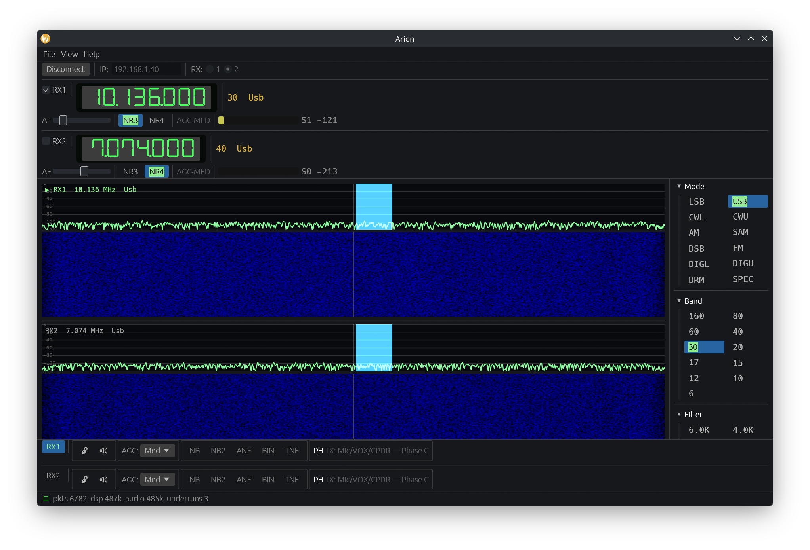
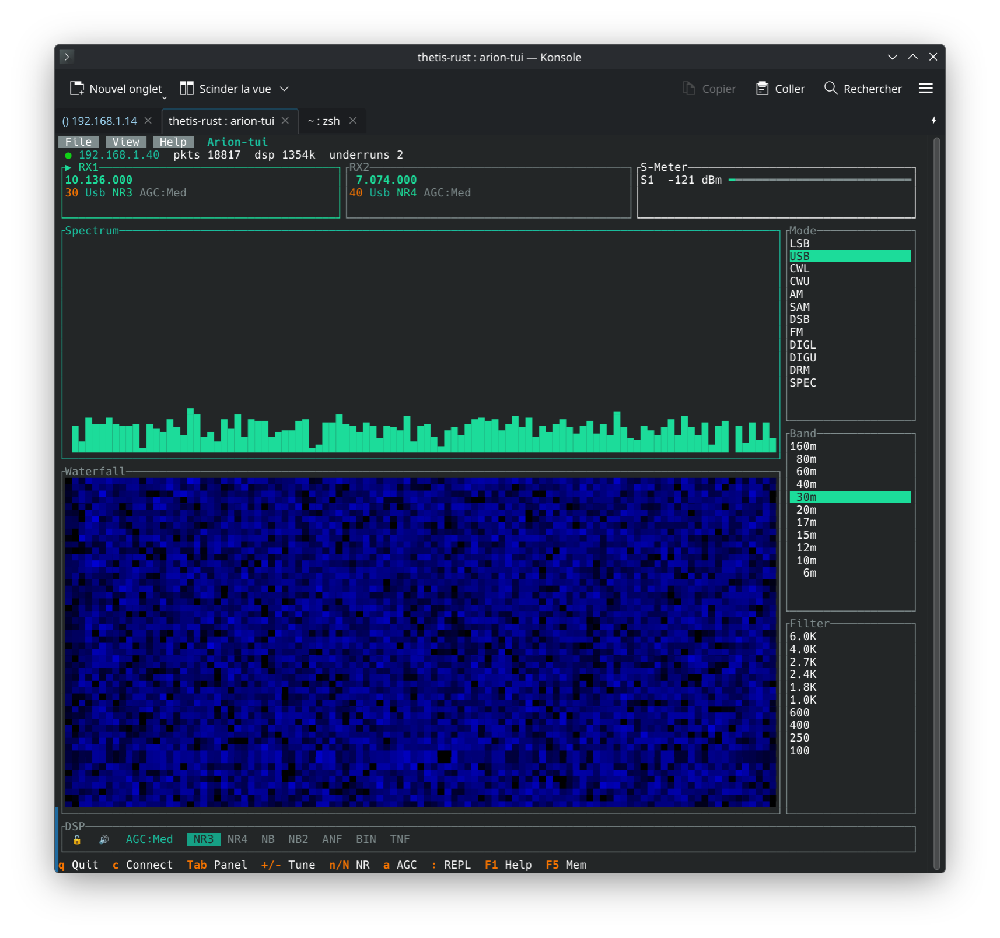

<p align="center">
  <strong>Arion</strong> — A modern SDR control application for HermesLite 2 & Apache Labs radios
</p>

<p align="center">
  
  
  
  
</p>

---

> **Warning — Proof of Concept.**
> Arion is under active development and not production-ready.
> APIs, file formats, and configuration will change without notice.
> Use at your own risk — contributions and feedback welcome.

## Screenshots

**Desktop** (egui + wgpu)



**Console** (ratatui — works over SSH/tmux)



## What is Arion?

Arion is a cross-platform SDR (Software Defined Radio) control
application for [HermesLite 2](http://www.hermeslite.com/) and
Apache Labs ANAN radios, written in Rust. It communicates with the
radio hardware via HPSDR Protocol 1 over Ethernet.

Inspired by [Thetis](https://github.com/ramdor/Thetis) (archived
April 2026), Arion is a **ground-up rewrite** — not a port — with
a modern architecture designed for multiple platforms and frontends
from day one.

### Why Arion?

In Greek mythology, Arion was a legendary musician whose song was so
powerful that a dolphin carried him safely across the sea. Like its
namesake, Arion transforms waves into music — radio waves into audio.

## Features

- **Dual RX** — two independent DDC receivers (RX1 + RX2)
- **DSP** — NR3 (RNNoise), NR4 (libspecbleach), ANF, SNBA, binaural,
  10-band graphic EQ with presets, variable passband filter
- **Spectrum & Waterfall** — real-time display with peak hold,
  averaging, configurable dB range, spectrum fill
- **S-Meter** — S-units display with per-band calibration
- **Band stack** — quick-jump between amateur bands with memory
- **Memories** — named frequency/mode bookmarks
- **Rhai scripting** — built-in REPL with syntax highlighting;
  every UI action is scriptable
- **Two frontends** on one shared core (MVVM architecture):
  - `arion` — egui + wgpu desktop with 7-segment VFO display,
    resizable panels, floating windows, Setup with 5 tabs
  - `arion-tui` — ratatui console for SSH / tmux / headless servers
- **Self-contained build** — FFTW, rnnoise, libspecbleach vendored;
  no system libraries or `pkg-config` needed
- **Cross-compile** — Linux → Windows in one command
- **Instant startup** — embedded FFTW wisdom blob (first launch <1s)

## Quick start

### Prerequisites

- Rust stable ≥ 1.82
- A [HermesLite 2](http://www.hermeslite.com/) or Apache Labs ANAN
  radio on the local network
- Audio: ALSA (Linux), CoreAudio (macOS), WASAPI (Windows)
- GPU: Vulkan, Metal, or DX12 (for the desktop frontend only)

### Build & run

```sh
git clone --recurse-submodules <url>
cd arion

# Desktop (egui)
HL2_IP=192.168.1.40 cargo run -p arion --release

# Console (ratatui — no GPU required, works over SSH)
HL2_IP=192.168.1.40 cargo run -p arion-tui-bin
```

### Cross-compile Linux → Windows

```sh
# Install cross compiler (Arch: pacman -S mingw-w64-gcc)
rustup target add x86_64-pc-windows-gnu
PATH="$HOME/.cargo/bin:$PATH" \
  cargo build --target x86_64-pc-windows-gnu --release -p arion
# → target/x86_64-pc-windows-gnu/release/arion.exe
```

## Architecture

Arion follows a strict **MVVM + Hexagonal Architecture** pattern:

```
Frontends (Views)          arion-egui (desktop)
                           arion-tui  (console)
                                │
ViewModel                  arion-app  (headless, zero UI dep)
                                │
Model / Ports              arion-core (Radio, DSP thread)
                           arion-settings (TOML persistence)
                           arion-script (Rhai engine)
                                │
Infrastructure             wdsp / wdsp-sys (WDSP C FFI)
                           hpsdr-net (HPSDR P1 UDP)
                           arion-audio (cpal + rubato)
```

Key design rules:
- **One command path** — UI clicks, keyboard shortcuts, and Rhai
  scripts all call the same `App::set_*` methods
- **Humble views** — frontends only read state and dispatch actions
- **Zero UI dep in core** — `arion-app` compiles and tests headless

See [`docs/ARCHITECTURE.md`](docs/ARCHITECTURE.md) for full details
including data flow diagrams, threading model, and design patterns.

## Workspace

```
crates/
  wdsp-sys/          Raw FFI to vendored WDSP (FFTW, rnnoise, specbleach)
  wdsp/              Safe Rust wrapper (Channel, Mode, EQ, wisdom)
  hpsdr-protocol/    HPSDR Protocol 1 wire types
  hpsdr-net/         UDP discovery + multi-RX session
  arion-audio/       cpal output + ring buffer + resampling
  arion-core/        Radio orchestrator (net → DSP → audio)
  arion-settings/    TOML persistence (atomic write)
  arion-app/         Headless view-model (MVVM core)
  arion-script/      Rhai scripting engine + bindings
  arion-egui/        egui desktop frontend (DSEG7 VFO, waterfall, EQ, REPL)
  arion-tui/         ratatui console frontend (waterfall, side panel, popups)
apps/
  arion/             Desktop binary
  arion-tui/         Console binary
thetis-upstream/     Git submodule: original Thetis C# source (read-only reference)
```

## Roadmap

| Phase | Status | Description |
|---|---|---|
| A | Done | Foundations + minimal RX on HermesLite 2 |
| B | Done | Daily-usable RX (multi-RX, NR, click-to-tune, bands, persistence, cross-compile) |
| D | Done | Thetis-style UI, MVVM refactor, Rhai scripting, TUI frontend |
| E | Partial | DSP bindings (ANF, EQ, SNBA done; PureSignal, Diversity need antenna) |
| C | Planned | TX (SSB/CW), CAT Kenwood server, TCI server, MIDI |
| F | Planned | CI, installers, documentation, audio recording |

## Known limitations

- **No TX** — transmit pipeline not implemented yet (Phase C)
- **No CAT / TCI** — external control protocols not yet available
- **NB / NB2** — noise blanker UI toggles exist but are not wired to
  DSP (upstream WDSP uses complex ANB/NOB structures)
- **Single sample rate** — 48 kHz only from the radio; rubato handles
  device-side resampling
- **No installer** — build from source required

## Scripting

Arion embeds a [Rhai](https://rhai.rs) scripting engine. The desktop
app ships a REPL + multi-tab editor (menu *View → Scripts*), lets you
build custom panels and menus, and auto-loads a startup script.

- **Full reference** — see [`docs/SCRIPTING.md`](docs/SCRIPTING.md).
- **Examples** — `examples/scripts/01_basics.rhai` …
  `06_ui_complete.rhai`.
- **Startup script** — `~/.config/arion/startup.rhai` (Linux) is
  loaded once on launch; use it to declare persistent windows, menu
  items, and presets.
- **REPL help** — type `help()` or `help("topic")`.

## External control (rigctld)

Arion embeds a Hamlib-`rigctld`-compatible TCP server so that WSJT-X,
fldigi, GPredict, CQRLOG and friends can drive the radio like any
other rig. Enable it in *Setup → Network*; default port is 4532.

- **Full reference** — see [`docs/RIGCTLD.md`](docs/RIGCTLD.md).
- **WSJT-X** — *Radio = Hamlib NET rigctl*, *Network Server =
  `127.0.0.1:4532`*, *Poll Interval = 1 s*.

## Contributing

Arion is in early development. Bug reports and feature requests via
[issues](../../issues) are welcome. If you'd like to contribute code,
please open an issue first to discuss the approach.

## License

[GPL-3.0-or-later](LICENSE)
